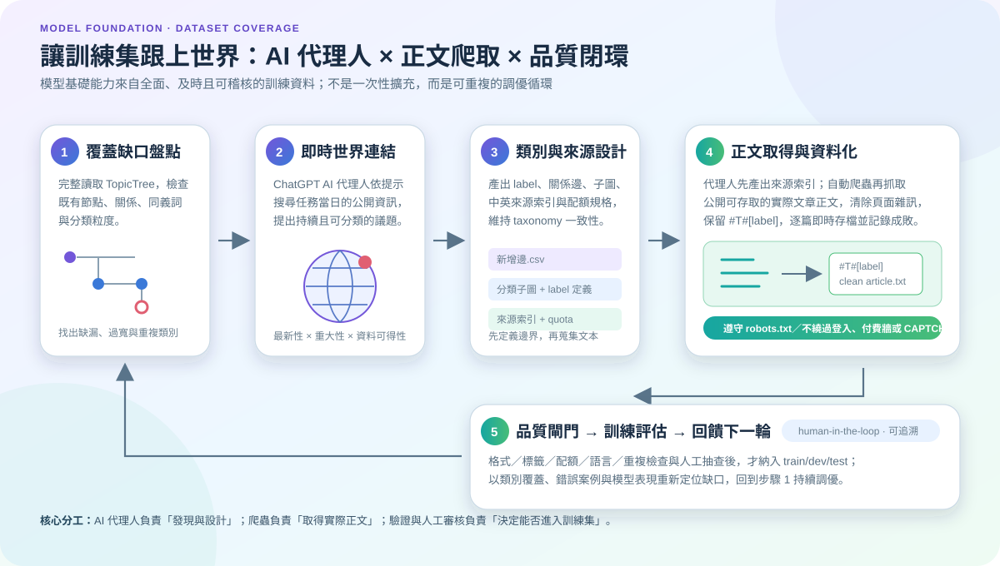
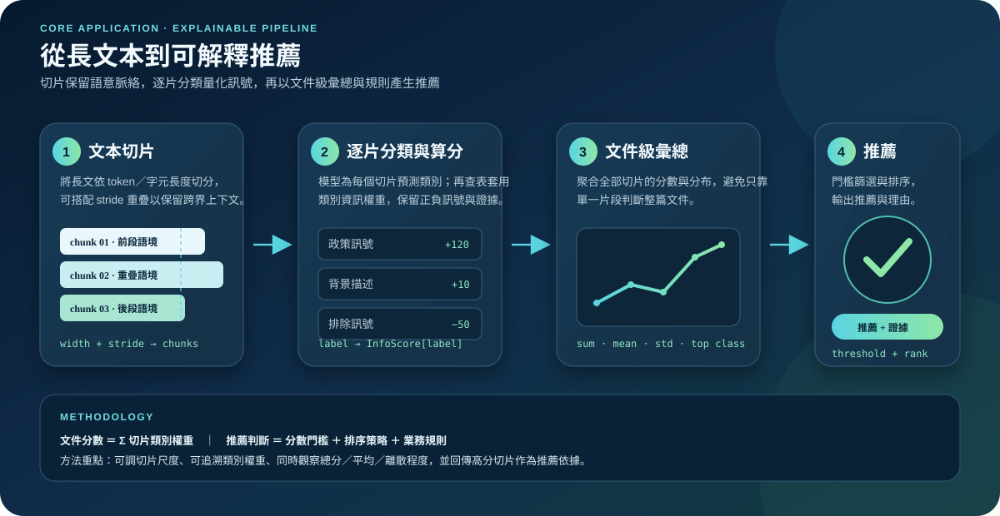
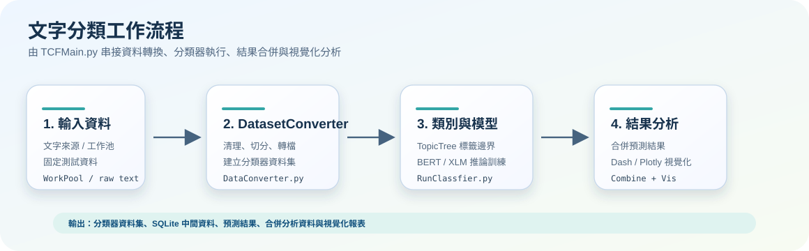
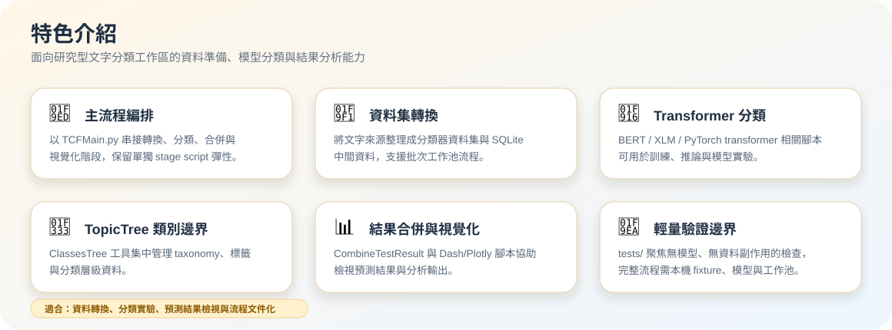

# text-category-profiler

`text-category-profiler` 是一個以 Python 腳本組成的文字分類、資料集轉換與分類結果分析工具集。Repository 目前呈現為開發／研究型工作區：根入口 `TCFMain.py` 會串接資料轉換、BERT／XLM 分類器執行，以及分類結果合併與視覺化分析；多數命令需要本機資料、模型與工作目錄設定後才能安全執行。

## 目前狀態

- 階段：待確認；目前程式與樣本顯示為內部資料處理與模型實驗工作區。
- 已具備：資料集轉換、BERTScript 分類流程、分類結果合併、Dash/Plotly 視覺化相關腳本、Class tree 工具與共用 Python utilities。
- 主要限制：根目錄已提供 `requirements.txt` 與輕量測試，但尚無 lockfile 或 CI；模型、資料集、工作池與部分外部路徑需由使用者提供。


## 核心能力

| 能力層 | 解決的問題 | 方法 |
| --- | --- | --- |
| **模型基礎：訓練集調優** | 類別是否全面覆蓋快速變動的世界議題？ | AI 代理人盤點缺口、連結當前公開資訊、設計 taxonomy 與來源索引；爬蟲取得實際正文，再經品質閘門進入訓練。 |
| **應用層：評分與推薦** | 如何把長文本轉成可追溯的推薦？ | 文本切片、逐片分類算分、文件級彙總、門檻與排序，並回傳關鍵證據片段。 |

### 1. 模型基礎：AI 代理人驅動的訓練集調優



`TextClassificationDatasetOptimization/` 提供一組 ChatGPT AI 代理人提問模板：先完整檢查既有分類圖的節點、關係、同義詞與粒度，再要求代理人搜尋執行當日的公開資訊，找出具有重大性、持續性與足夠文本量的缺漏議題。下一階段可設計新 label、父子關係、檢索橋接、分類子圖、來源索引與資料配額，讓 taxonomy 擴充和訓練資料蒐集使用同一套邊界。

AI 代理人通常只提供來源與摘要，而不是可直接投入訓練的完整實際正文。Repository 因此另附以 ChatGPT 協作開發的正文抓取工具：依來源索引批次取得公開可存取的文章主文，清除頁面雜訊、保留 `#T#[類別]`，並逐篇即時存檔及記錄失敗原因；工具不會繞過登入、付費牆、CAPTCHA、Cloudflare 或 `robots.txt` 限制。產物仍須通過格式、標籤、語言、配額、重複與人工抽查，才適合納入訓練集。

#### 訓練集調優的五個控制點

1. **覆蓋盤點**：不可只比對關鍵字；需沿分類關係檢查別名、交叉父類別與既有涵蓋範圍。
2. **即時議題查核**：以任務當日的可靠公開來源驗證重大性、持續性、分類邊界和資料可得性。
3. **Taxonomy 治理**：先確定 label、粒度、主要路徑和必要橋接，再建立來源索引，避免為單一事件製造捷徑。
4. **正文資料化**：代理人負責發現與設計，爬蟲負責取得實際正文；兩者輸出不能混為同一種訓練資料。
5. **品質閉環**：以資料驗證、人工審核與模型錯誤案例回饋下一輪缺口盤點，而非無條件把爬取結果投入訓練。

### 2. 應用流程：文本切片 → 算分 → 推薦



長文本先依 token／字元長度切成可推論片段，必要時以 stride 保留跨切片語境；分類器逐片預測類別，再由 `InfoScoreTable` 將類別映射為資訊分數。文件層彙總切片的總分、平均、離散程度與代表類別，最後搭配門檻、排序和業務規則輸出推薦，並保留高分切片作為可追溯的推薦依據。

#### 評分推薦的四個控制點

1. **切片策略**：依模型上下文限制選擇切片寬度與 stride，在推論成本和語境完整度間取捨。
2. **評分治理**：以明確的類別權重表管理正向、背景與排除訊號，讓分數定義可調整、可稽核。
3. **文件彙總**：同時觀察 `InfoScoreSum`、`InfoScoreMean`、`InfoScoreStd` 與高分代表類別，降低單一切片誤判的影響。
4. **推薦決策**：以分數門檻和排序產生候選，再疊加任務規則；推薦結果應連同關鍵切片呈現，而不是只輸出二元結論。

## 專案全景

### 端到端處理流程



### 功能特色



## 快速開始

### 前置需求

- Python runtime：建議 Python 3.8+；多程序工具會依 Python 版本載入對應 `istarmap` patch。
- 依賴安裝：根目錄提供 `requirements.txt` 作為目前已盤點的共用 runtime/test 需求；GPU/CUDA 相關套件仍需依主機調整。
- 本機資料與模型：多數完整流程依賴 `WorkPool`、資料集目錄、模型目錄或固定測試資料路徑。

### 安裝

建議先建立虛擬環境，再安裝根目錄需求：

```bash
python -m pip install -r requirements.txt
```

> 注意：`tensorflow`、`torch`、`bitsandbytes` 等 ML 套件可能需要依作業系統、Python 版本、CUDA/GPU 驅動改用主機相容版本；若只執行文件或輕量功能測試，不一定需要完整模型 runtime。

### 執行

根入口由 `TCFMain.py` 提供，範例註解顯示可用於 WeiTech／SDSMS 工作池流程；實際參數需依本機資料與模型調整：

```bash
python TCFMain.py --WeiTechworkIDPath <path-to-work-id-root> --WeiTechWorkPoolPATH <path-to-work-pool> -p 8099999 -TRVHost False -task SDSMS_Prediction
```

> 注意：以上命令會讀寫工作池與輸出資料，初始化時未執行。請先確認資料、模型與輸出路徑。

### 驗證

目前已提供不依賴資料集、模型或 GPU 的輕量功能測試，優先用來保護 console display helper 與 repository 說明檔的基本契約：

```bash
python -m unittest discover -s tests
```

程式語法檢查可針對修改過的模組執行：

```bash
python -m py_compile <changed-python-files>
```

完整 `python TCFMain.py ...` 流程仍需本機資料、模型與工作池，會讀寫產物；未確認測試 fixture 前不要當作無副作用驗證。

## Repository 結構

| 路徑 | 用途 |
| --- | --- |
| `TCFMain.py` | 根流程入口；串接 DataConverter、RunClassfier、CombineTestResult 與 Test_result_Vis。 |
| `TCF_Params/` | 分類流程參數、工作池根目錄、BERTScript 路徑與任務預設值。 |
| `DatasetConverter/` | 將原始文本／資料來源轉換為分類器使用的資料集、SQLite 與記錄檔。 |
| `BertScript/` | BERT／XLM 分類、訓練／推論、結果合併與 Dash/Plotly 視覺化腳本；包含部分第三方 BERT/Dash 範例內容。 |
| `ClassesTree/` | 類別樹、標籤工具與視覺化實驗。 |
| `TextClassificationDatasetOptimization/` | ChatGPT AI 代理人提示模板、taxonomy 擴充成果、來源索引、訓練集 PoC 與公開文章正文抓取工具。 |
| `text_category_profiler/` | 與 repository 同名的 Python package，目前依 `core`、`data`、`concurrency`、`pipeline`、`text`、`visualization`、`integrations` 分流；程式以 `text_category_profiler.<domain>.<module>` 匯入。 |
| `tests/` | 輕量功能測試；避免依賴資料集、模型、GPU 或工作池副作用。 |
| `.codex/` | Codex 專案記憶、工作流、架構、契約與初始化狀態文件。 |

## 輸入、輸出與資料邊界

- 主要輸入：文字資料集、固定測試資料、工作池任務目錄與已訓練模型目錄。
- 主要輸出：分類器資料集、SQLite 中間資料庫、預測結果、合併後分析資料與視覺化輸出。
- 不應提交 Git：真實工作池資料、模型 checkpoint、大型資料集、logs、outputs、秘密、憑證與內部連線設定。
- 最小測試資料：待確認；repository 內含若干 sample 檔案，但尚未確認可作為完整 smoke fixture。

## 文件

- Codex 專案概況：`.codex/project.md`
- 開發與驗證流程：`.codex/workflows.md`
- 架構導覽：`.codex/architecture.md`
- 介面契約：`.codex/contracts.md`
- 已知問題與待確認事項：`.codex/known_issues.md`

## 已知限制

- 根 README 先前描述 FastAPI／Elasticsearch RAG 代理人，但目前根目錄盤點未找到對應 `api/`、`agent/`、FastAPI manifest 或 RAG runtime；本 README 已改為反映目前可由程式碼查證的文字分類工作區。
- 根目錄已有 `requirements.txt` 與輕量 `unittest` 測試；但完整依賴版本仍需在目標主機依 Python/CUDA/模型條件確認。
- 多數 runnable 腳本可能讀寫本機資料、工作池或模型產物；未確認資料邊界前不要當作無副作用測試執行。
