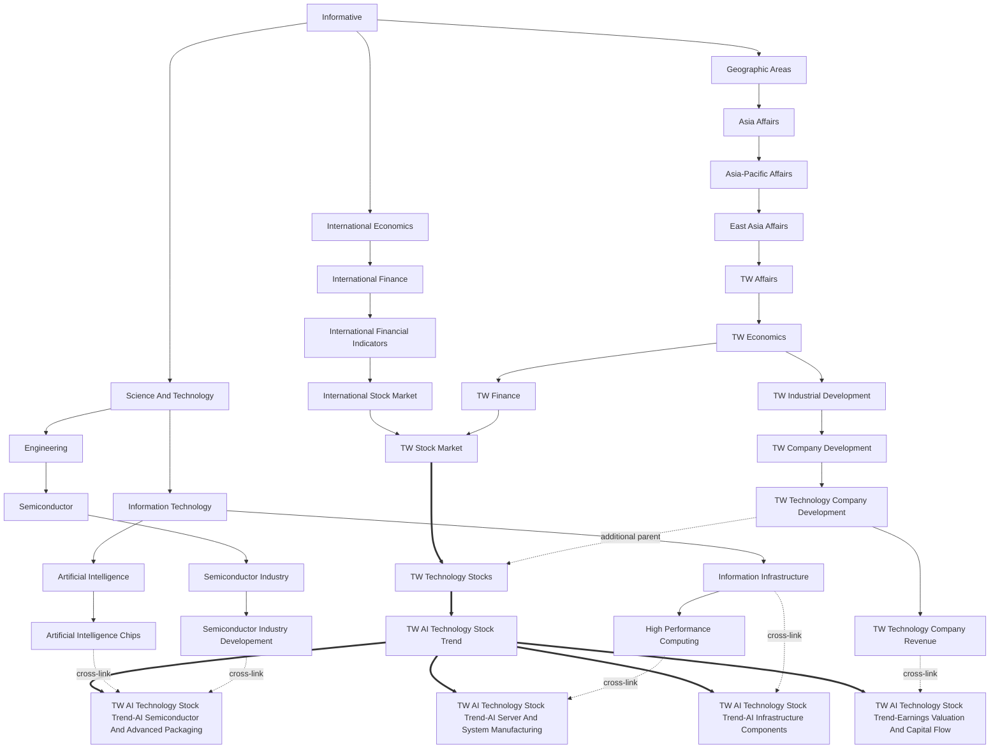

# TW AI Technology Stock Trend — Upstream and Downstream Topic Subgraph

## Proposed label

- **Recommended focal label:** `TW AI Technology Stock Trend`
- **New intermediate node:** `TW Technology Stocks`
- **Primary placement:** `TW Stock Market → TW Technology Stocks → TW AI Technology Stock Trend`
- **Additional taxonomy context:** `TW Technology Company Development → TW Technology Stocks`

The proposed English label follows the existing taxonomy's country-prefix and Title Case noun-phrase style. “Stock Trend” keeps the scope on market movement and market interpretation rather than on AI technology in general.

## Mermaid subgraph

## Newly added edges

| Parent | Child | Relationship | Note |
|---|---|---|---|
| `TW Stock Market` | `TW Technology Stocks` | `contains` | 新增主要層級；台灣股票市場下的科技股集合 |
| `TW Technology Company Development` | `TW Technology Stocks` | `contains` | 新增交叉父類別；連結科技公司發展與股票市場 |
| `TW Technology Stocks` | `TW AI Technology Stock Trend` | `contains` | 新增主要層級；焦點類別 |
| `TW AI Technology Stock Trend` | `TW AI Technology Stock Trend-AI Semiconductor And Advanced Packaging` | `contains` | 新增底層細緻類別 |
| `TW AI Technology Stock Trend` | `TW AI Technology Stock Trend-AI Server And System Manufacturing` | `contains` | 新增底層細緻類別 |
| `TW AI Technology Stock Trend` | `TW AI Technology Stock Trend-AI Infrastructure Components` | `contains` | 新增底層細緻類別 |
| `TW AI Technology Stock Trend` | `TW AI Technology Stock Trend-Earnings Valuation And Capital Flow` | `contains` | 新增底層細緻類別 |
| `Artificial Intelligence Chips` | `TW AI Technology Stock Trend-AI Semiconductor And Advanced Packaging` | `contains` | 新增交叉父類別；AI晶片主題連結 |
| `Semiconductor Industry Developement` | `TW AI Technology Stock Trend-AI Semiconductor And Advanced Packaging` | `contains` | 新增交叉父類別；半導體產業發展連結 |
| `High Performance Computing` | `TW AI Technology Stock Trend-AI Server And System Manufacturing` | `contains` | 新增交叉父類別；高效能運算與AI伺服器連結 |
| `Information Infrastructure` | `TW AI Technology Stock Trend-AI Infrastructure Components` | `contains` | 新增交叉父類別；資料中心基礎設施連結 |
| `TW Technology Company Revenue` | `TW AI Technology Stock Trend-Earnings Valuation And Capital Flow` | `contains` | 新增交叉父類別；營收與基本面連結 |

## Fine-grained training labels

1. **AI Semiconductor And Advanced Packaging** — AI chips, foundry, ASIC/IP, advanced packaging, test, equipment and materials.
2. **AI Server And System Manufacturing** — rack-scale AI servers, ODM/OEM, system assembly, motherboards, industrial and edge systems.
3. **AI Infrastructure Components** — cooling, liquid cooling, power, BBU, PCB/CCL, networking, optical and high-speed interconnects.
4. **Earnings Valuation And Capital Flow** — revenue, earnings, EPS, margins, valuation, target prices, institutional flows and market positioning.

## Training data policy

The package contains 100 Chinese and 100 English `.txt` records for each fine-grained label. The files use public-source indexes and newly written classification summaries rather than copied article bodies. Each language-label pair exceeds 100,000 characters. `quota_report.csv` and `training_data_manifest.csv` provide counts, character totals, source-index metadata and URLs.
